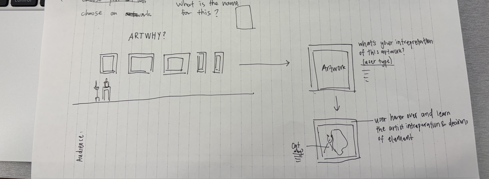
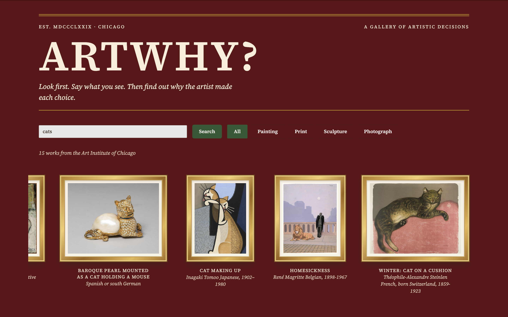

# Day 1 "before" snapshot

Write your own, even if you worked in a pair. Keep it: we come back to it at mid-quarter (Week 6) and at the end (Week 11). Your prompts go in `ai_log.md`, not here.

**Name:** Riley Fang
**Partner (if any):** Charlene Siswanto

## Before we prompted

### 1. Who is it for, and what do they want to do?

It's for art students who want to learn how artists make creative decisions in famous artworks.
**"The user can..." sentences:**
1.Explore a famous artwork by hovering over different elements to learn their meaning and reasoning behind the artist’s choices.
2.Interpret an artwork themselves before revealing information about its composition, symbolism, and historical context.
3 Learn about the artist’s life and experiences to understand why they chose elements in the artwork the way they did.

### 2. Our sketch

Put the photo in this `hw0` folder, then change the filename below to match:

### 3. Our prediction

We expected the ai would take the sketch properly and create the website that is interactive.

## What we got

### 4. What the AI made

Put the screenshot in this `hw0` folder, then change the filename below to match:

### 5. Sketch vs. app

- **Matches our sketch:** The enter box and explanation part is matching our sketch.
- **Different from our sketch:** At first, it followed most of the sketch except for the hero section. We wanted our artwork to rotate in a circle, but the AI just showed all the artwork at once and placed it under the title.
- **The AI decided** (something we never said): It decided to create a separate section for each artwork next to the search bar. It also added a description next to the title, which we never mentioned. They also create a font style and size by itself.

### 6. What did I keep, change, or reject, and why?
We changed the font style and color and removed some small parts that weren't needed. The first attempt it made wasn't quite what we expected, so we asked a couple more questions to correct the style. I think this is also because AI doesn't really know what is going to look great.

### 7. Explain back

Pick one part of the code. In your own words, what does it do?
<helmet>
  <link rel="stylesheet" href="_ds/broadsheet-9f7df910-3a02-41d0-9056-c87372662e8b/styles.css">
  
  
</helmet>

This part is about the styling for the whole website. I asked AI to explain what the code means. It said that Helmet is a templating tool that lets a component add elements to the page. The link and script pull in the design system for this website. The style block overrides the colors, which helps us customize the look and overall style. Oklch is a CSS color format that uses three numbers to define a color.

## Looking ahead

### 8. What does it do? Does it work? What broke?
It is a fully working prototype that can generate reasons why artists use certain elements in their artwork. It worked inside the chat, but when I tried to publish it as an artifact and share it with my partner, it suddenly stopped working. I think it may be because we were limited to 150 lines, which made some function unreliable or easy to break.

### 9. How much do I understand about how it works? (0–100%)
**My number:**
Maybe 30% coding and 70% AI.

**Why that number:**
I've used AI to make other projects before, so I think I now have a sense of how to use it and work with it. The only coding class I've taken is AP CSA, and it's been a while. I also think AI uses some fancy code when it writes programs. I'm still learning how to guide it and get it to make something more reliable.

### 10. What would I need to know to tell whether it's *well designed or well built*?
I think well design is really base on what it looks good or bad, well build can have a lot of standard, i would said that good build means this thing is working in everywhere, all the device and all the place, also it is accessble for everyone to use.

### 11. What do I hope to be able to do by week 10?
I hope I can fix some of the AI's code myself and be able to create my own website (a portfolio). Able to use some open resource publish by other.